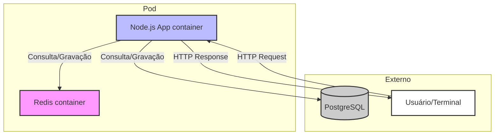

# Arquitetura de containers no Pod

- O Pod terá dois containers principais: Node.js App e Redis.
- O Node.js App se conecta ao Redis (cache) e ao PostgreSQL (banco principal).
- O usuário/terminal acessa apenas o Node.js App.
- O Redis acelera leituras e reduz carga do banco.
