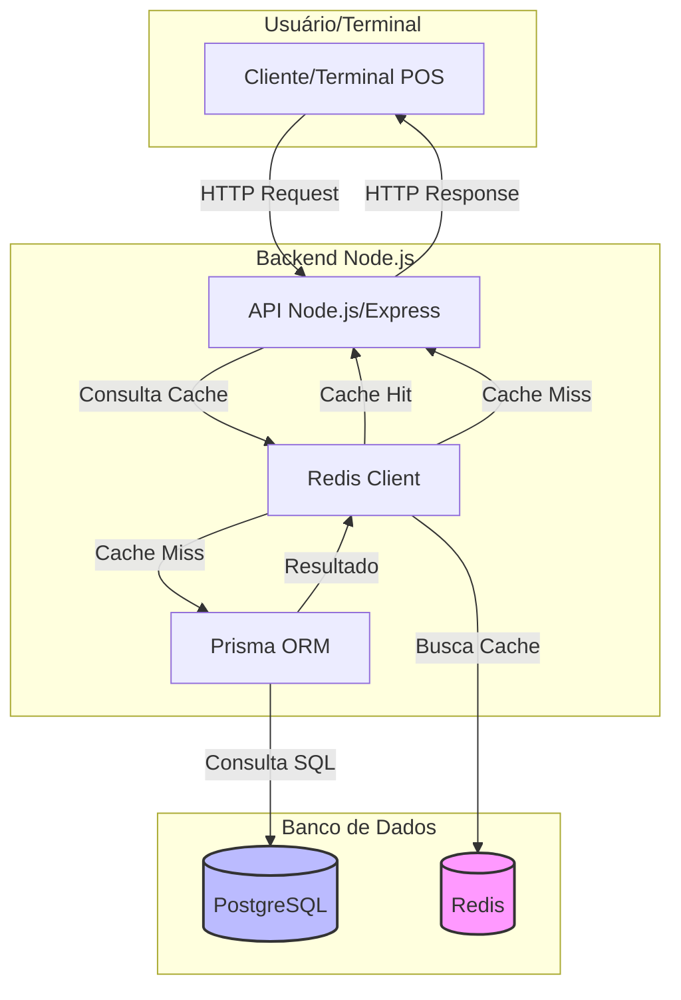

# Arquitetura com Redis (Mermaid)

- O terminal faz requisições para a API Node.js.
- A API consulta primeiro o Redis (cache) para dados frequentes (ex: lista de apps).
- Se não encontrar no cache (cache miss), consulta o PostgreSQL via Prisma.
- O resultado do banco é salvo no Redis para próximas requisições.
- O Redis acelera leituras e reduz carga do banco.
