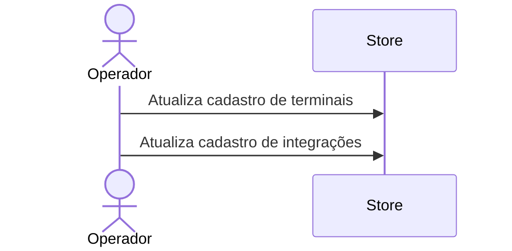
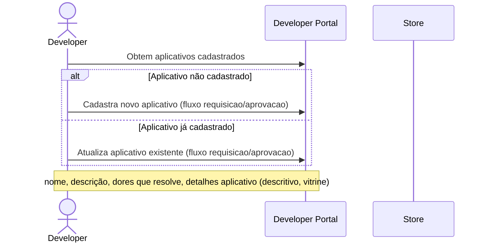

```mermaid
sequenceDiagram
   actor Operador
   participant Store

   Operador ->> Store: Atualiza cadastro de terminais
   Operador ->> Store: Atualiza cadastro de integrações
```

```mermaid
sequenceDiagram
   actor Developer
   participant DevPortal as Developer Portal
   participant Store

   Developer ->> DevPortal: Obtem aplicativos cadastrados
   alt Aplicativo não cadastrado
       Developer ->> DevPortal: Cadastra novo aplicativo (fluxo requisicao/aprovacao)
   else Aplicativo já cadastrado
       Developer ->> DevPortal: Atualiza aplicativo existente (fluxo requisicao/aprovacao)
   end
   note over Developer, DevPortal: nome, descrição, dores que resolve, detalhes aplicativo (descritivo, vitrine)
```   

