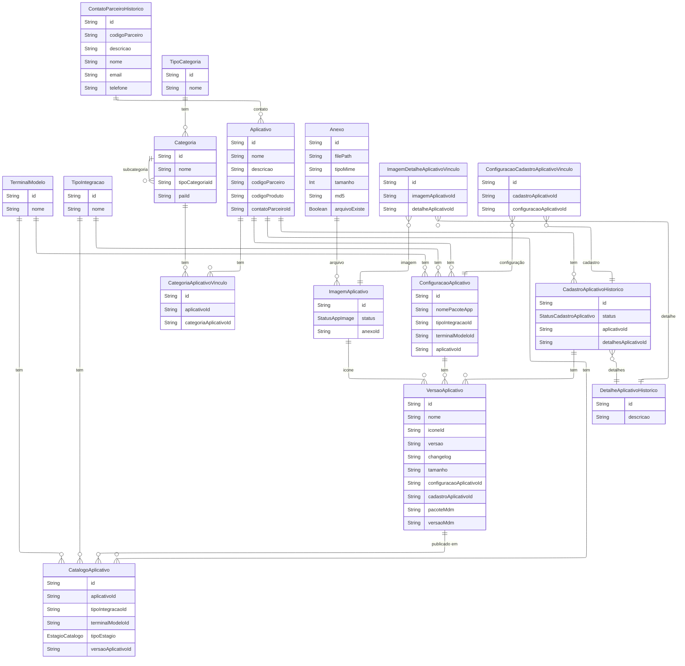

# Diagrama ER (Mermaid) com Colunas

```mermaid
---
config:
  layout: elk
---
erDiagram
	direction TB
	TerminalModelo {
		String id  ""
		String nome  ""
	}
	TipoIntegracao {
		String id  ""
		String nome  ""
	}
	ContatoParceiroHistorico {
		String id  ""
		String codigoParceiro  ""
		String descricao  ""
		String nome  ""
		String email  ""
		String telefone  ""
	}
	TipoCategoria {
		String id  ""
		String nome  ""
	}
	Categoria {
		String id  ""
		String nome  ""
		String tipoCategoriaId  ""
		String paiId  ""
	}
	CategoriaAplicativoVinculo {
		String id  ""
		String aplicativoId  ""
		String categoriaAplicativoId  ""
	}
	Aplicativo {
		String id  ""
		String nome  ""
		String descricao  ""
		String codigoParceiro  ""
		String codigoProduto  ""
		String contatoParceiroId  ""
	}
	Anexo {
		String id  ""
		String filePath  ""
		String tipoMime  ""
		Int tamanho  ""
		String md5  ""
		Boolean arquivoExiste  ""
	}
	ImagemAplicativo {
		String id  ""
		StatusAppImage status  ""
		String anexoId  ""
	}
	ImagemDetalheAplicativoVinculo {
		String id  ""
		String imagemAplicativoId  ""
		String detalheAplicativoId  ""
	}
	DetalheAplicativoHistorico {
		String id  ""
		String descricao  ""
	}
	ConfiguracaoAplicativo {
		String id  ""
		String nomePacoteApp  ""
		String tipoIntegracaoId  ""
		String terminalModeloId  ""
		String aplicativoId  ""
	}
	ConfiguracaoCadastroAplicativoVinculo {
		String id  ""
		String cadastroAplicativoId  ""
		String configuracaoAplicativoId  ""
	}
	CadastroAplicativoHistorico {
		String id  ""
		StatusCadastroAplicativo status  ""
		String aplicativoId  ""
		String detalhesAplicativoId  ""
	}
	VersaoAplicativo {
		String id  ""
		String nome  ""
		String iconeId  ""
		String versao  ""
		String changelog  ""
		String tamanho  ""
		String configuracaoAplicativoId  ""
		String cadastroAplicativoId  ""
		String pacoteMdm  ""
		String versaoMdm  ""
	}
	CatalogoAplicativo {
		String id  ""
		String aplicativoId  ""
		String tipoIntegracaoId  ""
		String terminalModeloId  ""
		EstagioCatalogo tipoEstagio  ""
		String versaoAplicativoId  ""
	}

	Aplicativo||--o{CatalogoAplicativo:"tem"
	Aplicativo||--o{ConfiguracaoAplicativo:"tem"
	Aplicativo||--o{CadastroAplicativoHistorico:"tem"
	Aplicativo||--o{CategoriaAplicativoVinculo:"tem"
	Categoria||--o{CategoriaAplicativoVinculo:"tem"
	Categoria||--o{Categoria:"subcategoria"
	TipoCategoria||--o{Categoria:"tem"
	TerminalModelo||--o{CatalogoAplicativo:"tem"
	TerminalModelo||--o{ConfiguracaoAplicativo:"tem"
	TipoIntegracao||--o{CatalogoAplicativo:"tem"
	TipoIntegracao||--o{ConfiguracaoAplicativo:"tem"
	ConfiguracaoAplicativo||--o{VersaoAplicativo:"tem"
	CadastroAplicativoHistorico||--o{VersaoAplicativo:"tem"
	CadastroAplicativoHistorico}o--||DetalheAplicativoHistorico:"detalhes"
	VersaoAplicativo||--o{CatalogoAplicativo:"publicado em"
	ImagemAplicativo||--o{VersaoAplicativo:"icone"
	ImagemDetalheAplicativoVinculo}o--||ImagemAplicativo:"imagem"
	ImagemDetalheAplicativoVinculo}o--||DetalheAplicativoHistorico:"detalhe"
	Anexo||--o{ImagemAplicativo:"arquivo"
	ContatoParceiroHistorico||--o{Aplicativo:"contato"
	ConfiguracaoCadastroAplicativoVinculo}o--||CadastroAplicativoHistorico:"cadastro"
	ConfiguracaoCadastroAplicativoVinculo}o--||ConfiguracaoAplicativo:"configuração"
```
