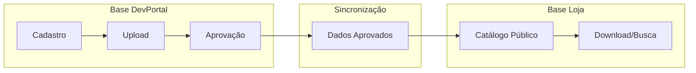
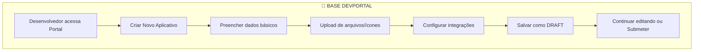
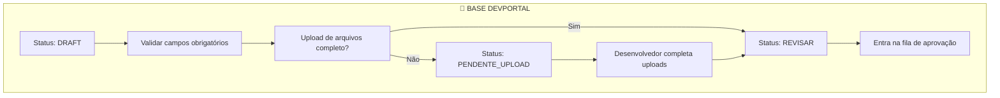
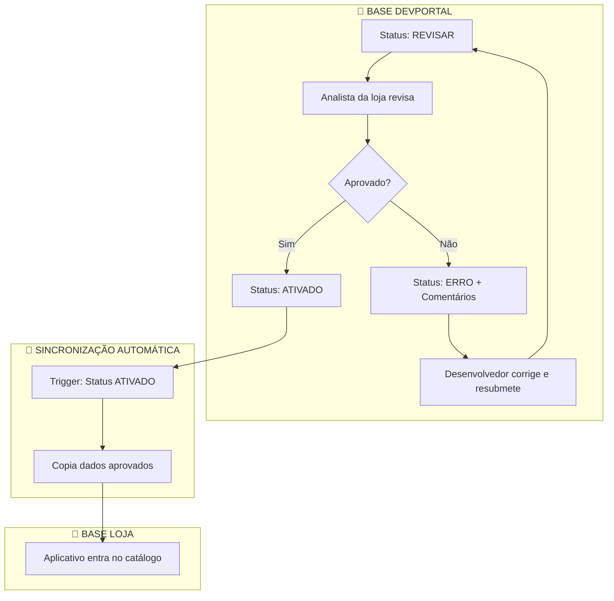
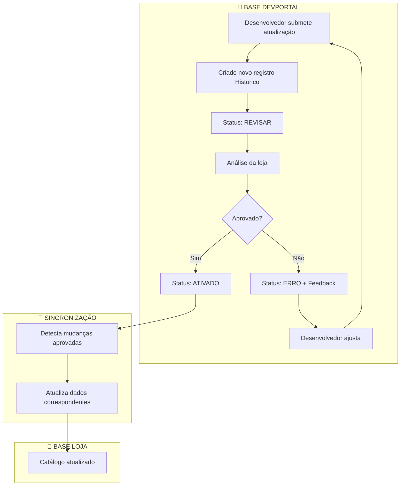
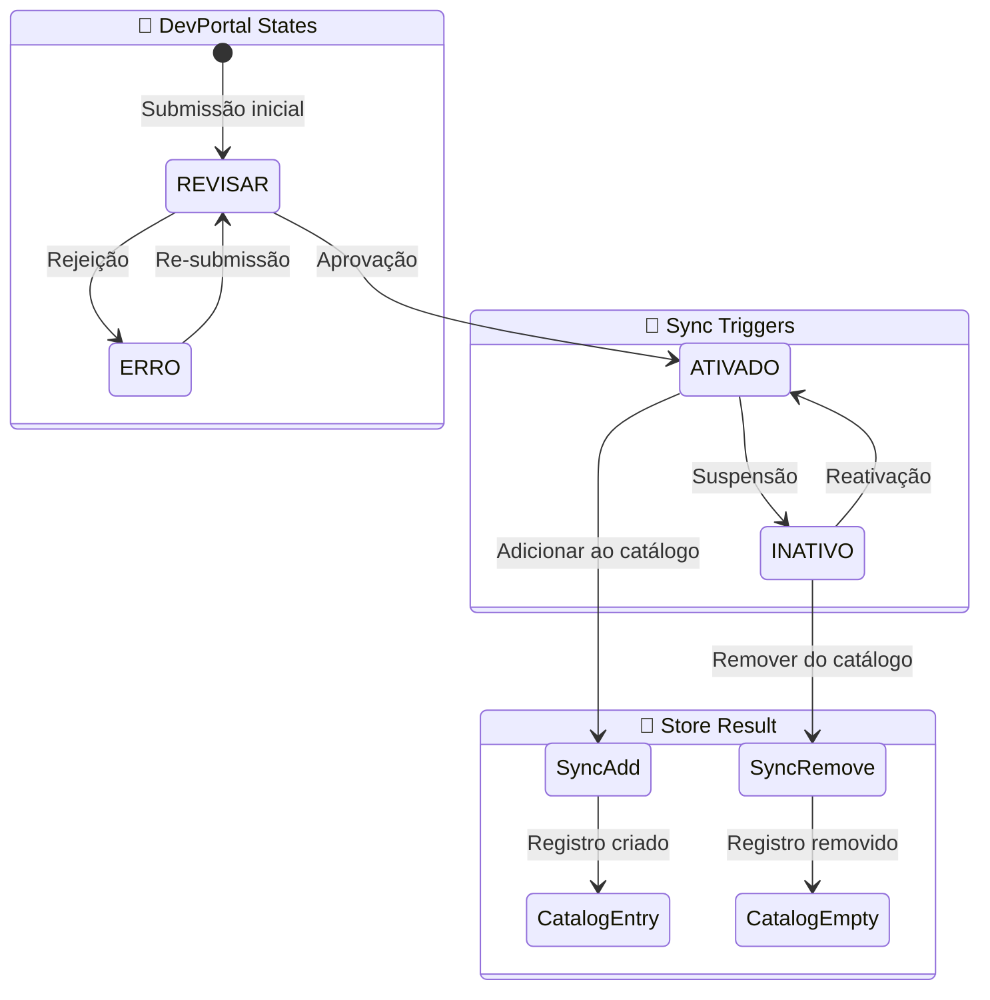
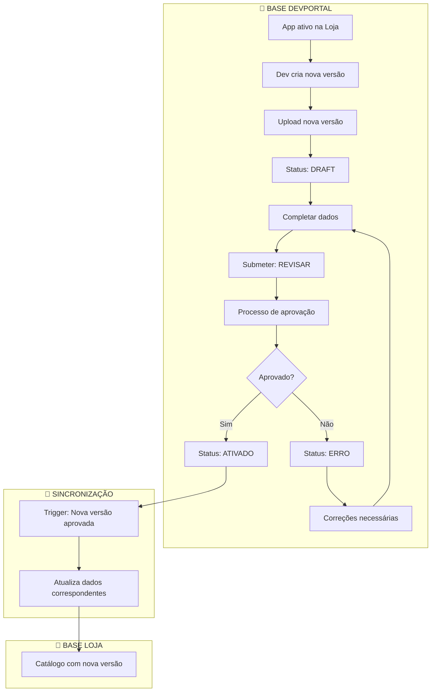
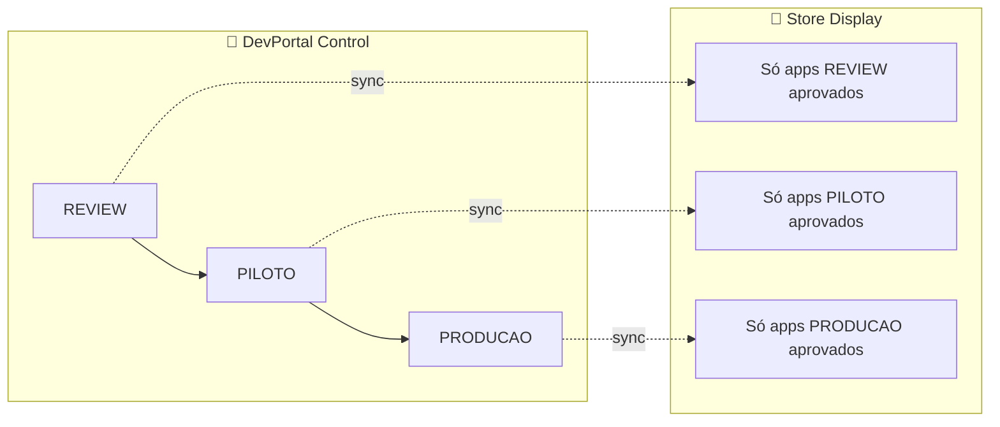
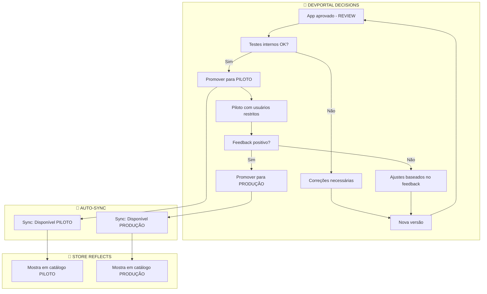

# Jornada de Cadastro e Atualização de Aplicativos

## Arquitetura do Sistema

O sistema opera com **DUAS BASES DISTINTAS**:

### 🔧 **Base do Portal do Desenvolvedor (DevPortal)**

- **TODAS** as operações de cadastro, edição e upload
- Gestão completa do ciclo de vida dos aplicativos
- Processo de aprovação e validação
- Ambiente de trabalho dos desenvolvedores

### 🏪 **Base da Loja de Aplicativos**

- **SOMENTE** dados aprovados e publicados
- Catálogo público para consumo
- Performance otimizada para busca e download
- Ambiente de produção para usuários finais

---

## ⚠️ **PRINCÍPIO FUNDAMENTAL**

> **NADA ACONTECE DIRETAMENTE NA LOJA**
>
> **TODO cadastro, upload e interação acontece na base do DevPortal.**
>
> **A Loja APENAS CONSOME dados aprovados via sincronização automática.**

---

## Visão Geral do Fluxo



---

## 1. Jornada de Cadastro Inicial (100% DevPortal)

### 1.1 Portal do Desenvolvedor - Submissão

> ✅ **LOCAL**: Base DevPortal  
> ✅ **AÇÃO**: Cadastro e upload de arquivos

**Status: DRAFT**



**Entidades envolvidas (TODAS na base DevPortal):**

- `Aplicativo` (dados básicos)
- `DetalheAplicativoHistorico` (descrições, imagens)
- `CadastroAplicativoHistorico` (status: DRAFT)
- `ConfiguracaoAplicativo` (integrações e modelos)
- `VersaoAplicativo` (versão inicial)

### 1.2 Submissão para Revisão

> ✅ **LOCAL**: Base DevPortal  
> ✅ **AÇÃO**: Validação e controle de status

**Status: DRAFT → PENDENTE_UPLOAD → REVISAR**



### 1.3 Processo de Aprovação

> ✅ **LOCAL**: Base DevPortal  
> ✅ **AÇÃO**: Aprovação e sincronização para Loja

**Status: REVISAR → ATIVADO/ERRO**



**⚠️ IMPORTANTE - Entrada no Catálogo:**

1. **DevPortal**: `CadastroAplicativoHistorico.status = ATIVADO`
2. **Sincronização**: Sistema automaticamente copia dados
3. **Loja**: Criado registro em `CatalogoAplicativo`

> **A LOJA NUNCA RECEBE DADOS DIRETAMENTE - SEMPRE VIA SINCRONIZAÇÃO**

---

## 2. Jornada de Atualização (100% DevPortal)

### 2.1 Tipos de Atualizações

> ✅ **LOCAL**: TODAS as atualizações acontecem na Base DevPortal  
> ✅ **AÇÃO**: Sincronização para Loja APENAS após aprovação

#### A) **Atualização de Metadados** (sem nova versão)

- Descrição, imagens promocionais, informações de contato
- **LOCAL**: Base DevPortal
- **NÃO** afeta versões já publicadas no catálogo
- **Status**: Pode ir direto para revisão

#### B) **Nova Versão do Aplicativo**

- **LOCAL**: Base DevPortal
- Novo arquivo executável, changelog, correções
- **Cria nova entrada** em `VersaoAplicativo`
- **Status**: Sempre REVISAR (análise completa necessária)
- **Risco**: Alto (pode quebrar compatibilidade)

#### C) **Configurações Críticas**

- **LOCAL**: Base DevPortal
- Mudanças em chaves de API, URLs de callback
- **Status**: Sempre REVISAR
- **Requer**: Re-aprovação completa

### 2.2 Fluxo de Atualização (Tudo no DevPortal)



**⚠️ VALIDAÇÃO IMPORTANTE:**

> **NUNCA** há inserção direta na Base Loja - **SEMPRE** via sincronização após aprovação DevPortal

---

## 3. Estados e Transições (Exclusivo DevPortal)

### 3.1 Estados Possíveis

**Base DevPortal** - `CadastroAplicativoHistorico.status`:

| Status    | Significado                          | Ação da Loja                  |
| --------- | ------------------------------------ | ----------------------------- |
| `REVISAR` | **DevPortal**: Aguardando análise    | **Loja**: Nenhuma             |
| `ATIVADO` | **DevPortal**: Aprovado              | **Loja**: Sincronizar dados   |
| `INATIVO` | **DevPortal**: Removido/suspenso     | **Loja**: Remover do catálogo |
| `ERRO`    | **DevPortal**: Rejeitado c/ feedback | **Loja**: Nenhuma             |

### 3.2 Diagrama de Estados



> **REGRA FUNDAMENTAL**: Store é **READ-ONLY** - apenas reflete aprovações do DevPortal

---

## 4. Versionamento e Controle (DevPortal-Centric)

### 4.1 Estratégia de Versões

**Local**: Todas as versões vivem na Base DevPortal  
**Fluxo**: `VersaoAplicativo` → Aprovação → Sincronização para Store

#### Cenários de Versionamento:

**A) Versão Principal Ativa**

- **LOCAL**: DevPortal (VersaoAplicativo)
- **Status**: Deve passar por processo completo de aprovação
- **Sincronização**: Para Store apenas após ATIVADO

**B) Versão de Correção/Patch**

- **LOCAL**: DevPortal
- **Mudanças**: Bugs críticos, correções menores
- **Status**: Análise acelerada possível

**C) **Novas Configurações\*\* (integrações/modelos)

- **LOCAL**: DevPortal (ConfiguracaoAplicativo)
- Suporte a novos terminais ou tipos de integração
- **Cria nova entrada** em `ConfiguracaoAplicativo`
- **Status**: Requer aprovação técnica

### 4.2 Fluxo de Atualização - Nova Versão (DevPortal)



### 4.3 Impacto no Catálogo (Store Read-Only)

**Cenários de atualização do catálogo:**

**DevPortal → Store Sync Rules:**

1. **Substituição**: Nova versão substitui a anterior no mesmo slot

   - **DevPortal**: VersaoAplicativo aprovada (ATIVADO)
   - **Sincronização**: Detecta mudança de versão
   - **Store**: `CatalogoAplicativo.versaoAplicativoId` é atualizado

2. **Expansão**: Nova configuração cria novo slot
   - **DevPortal**: Nova combinação de estágio/integração/modelo
   - **Sincronização**: Cria nova entrada
   - **Store**: Novo registro em `CatalogoAplicativo`

> **IMPORTANTE**: Store NUNCA altera dados - apenas reflete aprovações DevPortal

---

## 5. Gestão de Estágios (DevPortal-Managed)

### 5.1 Progressão de Estágios

> ✅ **CONTROLE**: DevPortal define qual estágio app está disponível  
> ✅ **REFLEXO**: Store mostra apenas apps aprovados para cada estágio



### 5.2 Estágios e Critérios (DevPortal)

**REVIEW**

- **LOCAL**: DevPortal - Ambiente de testes internos
- **CRITÉRIO**: Aprovação inicial da loja
- **AÇÃO**: Sync para Store apenas se ATIVADO

**PILOTO**

- **LOCAL**: DevPortal - Grupo restrito de usuários
- **CRITÉRIO**: Validação em ambiente controlado
- **AÇÃO**: Store reflete disponibilidade aprovada

**PRODUÇÃO**

- **LOCAL**: DevPortal - Disponível para todos os usuários
- **CRITÉRIO**: Versão final e estável
- **AÇÃO**: Store exibe para catálogo público

### 5.3 Fluxo de Promoção (DevPortal-Controlled)



> **REGRA**: Store não tem controle de estágios - apenas mostra o que DevPortal aprova

---

## 6. Portal do Desenvolvedor - Funcionalidades (DevPortal-Only)

### 6.1 Dashboard Principal (DevPortal Interface)

- **LOCAL**: 100% DevPortal
- Lista de aplicativos por status
- Métricas de aprovação/rejeição
- Notificações de mudanças de status

### 4.2 Gestão de Aplicativos

### 6.2 Categorias por Status (DevPortal Views)

**Aplicativos Ativos (Status: ATIVADO):**

- **LOCAL**: DevPortal
- Visualizar versões sincronizadas no catálogo Store
- Criar novas versões (sempre DevPortal)
- Acompanhar métricas de uso (agregadas de ambas as bases)

**Aplicativos em Revisão (Status: REVISAR):**

- **LOCAL**: DevPortal (exclusivamente)
- Status do processo de aprovação
- Comentários dos revisores
- Ações necessárias para aprovação

**Rascunhos (Status: DRAFT):**

- **LOCAL**: DevPortal (exclusivamente)
- Aplicativos em desenvolvimento
- Continuar edição
- Submeter para revisão

> **NOTA**: Store jamais vê aplicativos que não foram ATIVADOS

### 6.3 Gestão de Versões (DevPortal-Managed)

- Histórico completo de versões
- Comparação entre versões
- Rollback para versões anteriores (se necessário)

---

## 5. Fluxo Técnico - Estados do Sistema

### 5.1 Estados de CadastroAplicativoHistorico

```
DRAFT → PENDENTE_UPLOAD → REVISAR → ATIVADO
                                  ↘ ERRO
```

### 5.2 Sincronização com Catálogo

**Regra de Negócio:**

```sql
-- Um aplicativo só aparece no catálogo se:
WHERE CadastroAplicativoHistorico.status = 'ATIVADO'
  AND CatalogoAplicativo.versaoAplicativoId = VersaoAplicativo.id
```

### 5.3 Controle de Integridade

**Validações obrigatórias antes da aprovação:**

- Arquivo executável válido
- Ícone em formato correto
- Descrição completa
- Configurações de integração testadas
- Compatibilidade com modelos de terminal especificados

---

## 6. Considerações de UX

### 6.1 Comunicação com Desenvolvedor

- **Notificações push** para mudanças de status
- **Email automático** com detalhes de aprovação/rejeição
- **Dashboard visual** com progresso da aprovação

### 6.2 Processo de Feedback

- Comentários estruturados dos revisores
- Checklist de aprovação transparente
- Estimativa de tempo para revisão

### 6.3 Autodescoberta

- Sugestões de configurações baseadas em aplicativos similares
- Templates para descrições
- Validação em tempo real de campos obrigatórios

---

## 7. Métricas e Monitoramento

### 7.1 KPIs do Portal

- Tempo médio de aprovação
- Taxa de aprovação vs rejeição
- Aplicativos ativos por desenvolvedor
- Versões publicadas por mês

### 7.2 KPIs do Catálogo

- Downloads por aplicativo/versão
- Aplicativos por estágio
- Performance de busca no catálogo
- Adoção de novas versões

---

## 8. Segurança e Compliance

### 8.1 Validação de Arquivos

- Scan antivírus obrigatório
- Verificação de assinatura digital
- Análise estática de código

### 8.2 Auditoria

- Log completo via `LogAuditoria`
- Rastreabilidade de todas as ações
- Histórico de aprovações/rejeições

### 8.3 Controle de Acesso

- Permissões granulares no portal
- Separação entre ambientes (dev/prod)
- Autenticação multi-fator para publicação
