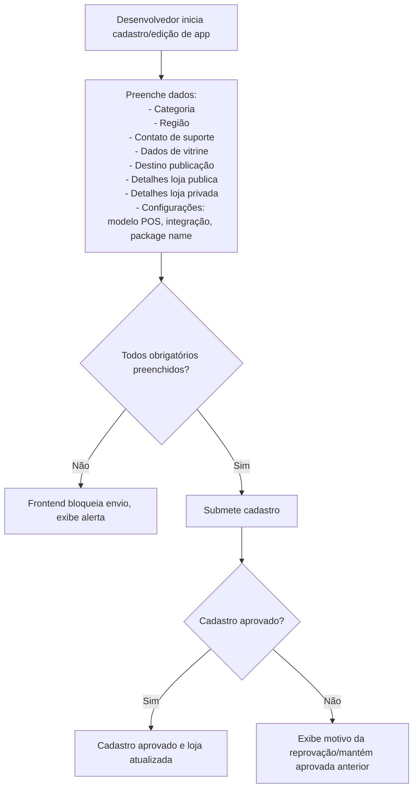
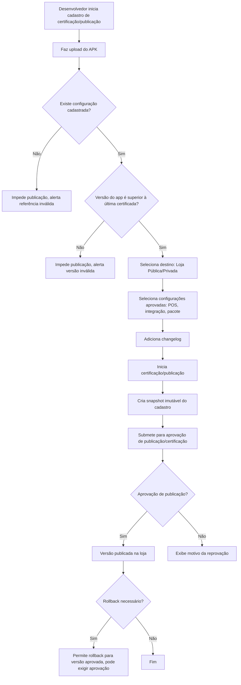
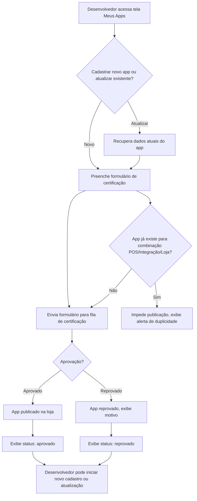
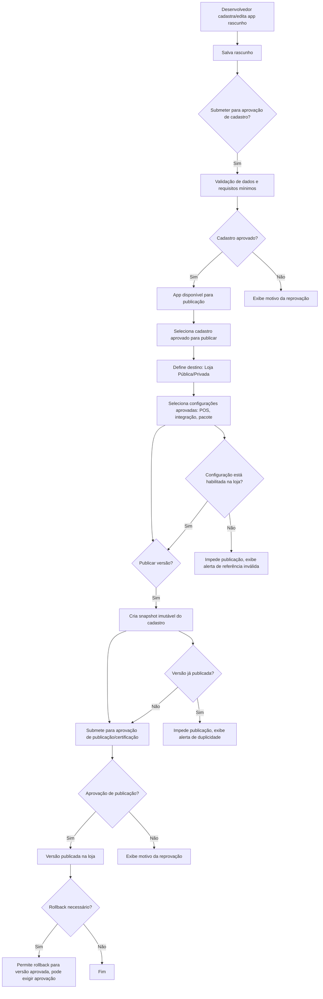

## Diagramas Detalhados: Cadastro e Publicação

### Fluxo de Cadastro (Mermaid)

### Fluxo de Publicação (Mermaid)

## Diagramas de Fluxo (Mermaid)

### Jornada AsIs

### Jornada ToBe (Quebra entre Cadastro e Publicação)

## Jornada de certificação de aplicativos

### AsIs

1. Desenvolvedor acessa a tela meus apps e nessa tela é listado um carrossel com as versões aprovadas, reprovadas caso existam ele sempre retorna o ultimo status delas.
Ex:
App1, Terminal Positivo, versao 1.0, Integracao Rfal Loja publica: aprovado
App1, Terminal Gertec, versao 1.0, Integracao Rfal Loja publica: reprovado
App1, Terminal Positivo, versao 1.0, Integracao Rfal Loja privada: aprovado
App1, Terminal Gertec, versao 1.0, Integracao Rfal Loja privada: reprovado

2. Nessa tela ele tem dois caminhos:
- Cadastrar novo aplicativo
- Atualizar aplicativo existente

3. Formulário de solicitacao de certifiacao
- Caso seja um aplicativo existente ele ja recupera os dados atuais cadastrados
**Itens de formulário**:
  - Tipo de distribuição (destino do aplicativo): Publica (Loja) ou Privada (MDM)
  - Modelo do terminal
  - Tipo de integração
    - Carta do LOA aprovada
  - Nome do aplicativo
  - Categorias selecionaveis (como ramos, ex: Supermercado, Varejo, etc)
  - Regiões de atuação (Sudeste, Nordeste, etc)  
  - Informações de contatos para suporte
    - Nome do parceiro
    - E-mail
    - Telefone
    - Horarios de atendimento
  - Metadados do aplicativo para vitrine
    - Icone do aplicativo
    - Descrição do aplicativo
    - Dores que resolve
    - Imagens do aplicativo
  - Metadados do aplicativo para loja publica
    - Icone do aplicativo
    - Descrição do aplicativo
    - Imagens detalhes do aplicativo
  - Aplicativo
    - Package name (extraido do APK)
    - Versão do aplicativo (extraido do APK)
    - Versão numérica do aplicativo (extraido do APK)

4. Após o envio do formulário, o aplicativo é enviado para a fila de certificação.

---

### ToBe: Quebra entre Cadastro e Publicação

1. **Cadastro de Aplicativo (Rascunho)**
   - Desenvolvedor cadastra ou edita um aplicativo no DevPortal.
   - O cadastro pode ser salvo como rascunho e editado quantas vezes quiser.
   - O cadastro passa por uma aprovação inicial (validação de dados, requisitos mínimos, etc).
   - Após aprovação do cadastro, o app fica disponível para publicação.

2. **Publicação de Aplicativo (Snapshot/Versão)**
   - Desenvolvedor seleciona um cadastro aprovado e inicia o processo de publicação.
   - Escolhe o destino: Loja Pública ou Distribuição Privada (MDM).
   - Define terminal, integração e demais parâmetros específicos da publicação.
   - No momento da publicação, é criado um snapshot dos dados do cadastro (descrição, imagens, etc), formando uma nova versão imutável.
   - A publicação também passa por aprovação (certificação, testes, etc).
   - Cada publicação é independente, com histórico e status próprios.

**Benefícios dessa quebra:**
- Permite múltiplos rascunhos e edições sem afetar publicações já feitas.
- Garante que só cadastros aprovados podem ser publicados.
- Cada publicação é um snapshot, preservando histórico e evitando sobrescrita.
- Aprovações separadas para cadastro (dados básicos) e publicação (entrega final).

**Fluxo resumido:**
1. Cadastro (rascunho) → Aprovação de cadastro → Publicação (snapshot) → Aprovação de publicação → Disponibilização (loja/privado)

*Esse modelo traz mais controle, segurança e rastreabilidade para todo o ciclo de vida do aplicativo.*

---

### Proposta de Centralização dos Dados no Cadastro

No passo de cadastro do aplicativo:
- Campos obrigatórios:
  - categoria
  - região
  - contato de suporte (nome do parceiro, e-mail, telefone, horários de atendimento)
  - dados da vitrine (ícone, descrição, dores, imagens principais)
- O desenvolvedor pode marcar se deseja suportar loja pública, privada ou ambas.
- Se marcar **loja pública**, deve preencher também as imagens de detalhes (requisito obrigatório apenas para esse destino).
- Se marcar **privada**, pode preencher descrição e imagens específicas para o contexto privado.
- Todos esses dados ficam editáveis no cadastro, reduzindo a carga de preenchimento na publicação da versão e somente são aplicados na versão certificada que for publicada.
- Deve ser também cadastrado as configurações do aplicativo combinando: modelo de pos, tipo de integraçao e nome do pacote (ex: android package name).

> Essa centralização evita duplicidade de dados e garante que todas as informações necessárias para a certificação estejam disponíveis no cadastro, facilitando o processo de publicação e certificação.
> Pelo menos um tipo de loja precisa ser selecionado (pública ou privada) para que o cadastro seja válido.
> Pelo menos uma configuração de terminal e integração deve ser selecionada para que o cadastro seja válido.
> Essas informações serão aplicadas na versão que for publicada na loja de aplicativos, sem afetar as publicações anteriores.

### Proposta para o Segundo Passo: Publicação/Certificação

No momento da publicação/certificação:
- O parceiro faz upload do APK e o sistema apresenta as configurações (modelo de POS, tipo de integração, nome do pacote) e destinos (loja pública, privada ou ambos) previamente cadastrados e aprovados.
- O parceiro seleciona quais combinações e destinos deseja submeter para certificação/publicação.
- Não é permitido editar dados do cadastro nesta etapa; apenas selecionar entre as opções já aprovadas.
- Cada submissão gera um snapshot imutável do cadastro e das configurações escolhidas, garantindo rastreabilidade.
- Caso o parceiro precise alterar qualquer informação (imagens, descrições, configurações), deve voltar ao cadastro, editar, submeter para nova aprovação e só então poderá publicar/certificar com os novos dados.

> Esse fluxo garante governança, integridade e clareza de contexto, além de facilitar auditoria e controle de versões para cada publicação/certificação realizada.

> Importante: Todas as solicitações de cadastro, atualização de dados de vitrine ou publicação/certificação passam obrigatoriamente por um fluxo de aprovação. Nenhuma alteração é aplicada automaticamente na loja ou nas versões publicadas sem validação prévia.

### Análise de Riscos e Mitigações

**Riscos Identificados:**
- **Atraso na Publicação:** O fluxo de aprovação obrigatório pode gerar filas e atrasos, especialmente em períodos de alta demanda.
- **Carga Operacional:** O time de aprovação pode ficar sobrecarregado, impactando a agilidade do processo.
- **Erros Humanos:** Aprovações manuais estão sujeitas a falhas, aprovações indevidas ou rejeições equivocadas.
- **Desalinhamento de Expectativas:** Parceiros podem não entender claramente o motivo de reprovações ou o status do pedido.
- **Atualizações de Vitrine:** Mudanças frequentes em campos de marketing podem gerar excesso de solicitações para aprovação.
- **Risco de Inconsistência:** Se o processo de aprovação não for bem auditado, pode haver divergência entre o que foi aprovado e o que está publicado.
- **Segurança e Fraudes:** Tentativas de burlar o fluxo para publicar apps não certificados ou alterar dados críticos sem aprovação.

**Mitigações Sugeridas:**
- Implementar painéis de acompanhamento de status e SLA para parceiros e time de aprovação.
- Automatizar validações técnicas e de preenchimento antes de enviar para aprovação manual, reduzindo o volume de solicitações triviais.
- Treinar e dimensionar o time de aprovação conforme a demanda.
- Fornecer feedback claro e detalhado sobre reprovações, com histórico e orientações de ajuste.
- Permitir agrupamento de atualizações de vitrine para aprovação em lote, reduzindo o volume de tarefas repetitivas.
- Manter logs e trilha de auditoria detalhada de todas as etapas e decisões do fluxo.
- Implementar alertas para tentativas de alteração não autorizada ou padrões suspeitos de submissão.

**Funcionalidades Sugeridas para Mitigação:**
- Dashboard inicial para parceiros e aprovadores, mostrando panorama de pendências, status de solicitações, reprovações e principais gargalos.
- Notificações automáticas por e-mail, push ou integração com ferramentas de times (ex: Slack, Teams) para avisar sobre novas pendências, aprovações, reprovações ou solicitações de ajuste.
- Filtros e relatórios para identificar gargalos, solicitações em atraso e motivos recorrentes de reprovação.
- Histórico detalhado de cada solicitação, com linha do tempo de ações, comentários e decisões.
- Permitir comentários e comunicação direta entre aprovador e parceiro dentro do sistema, facilitando ajustes rápidos.
- SLA configurável para cada etapa, com alertas automáticos para solicitações fora do prazo.
- Para o marketing: relatórios de alterações frequentes na vitrine, ajudando a identificar padrões de indecisão ou retrabalho. O próprio time pode ser alertado sobre excesso de mudanças e orientado a consolidar demandas antes de submeter.

> Observação: Mudanças frequentes na vitrine por parte do marketing são um problema de governança interna. O sistema pode ajudar a evidenciar o padrão, mas a solução passa por alinhamento e planejamento do próprio time de marketing.

> Com essas mitigações, o fluxo mantém a governança e integridade sem comprometer a experiência do parceiro ou a eficiência operacional.

**Proposta de Aprovação Colaborativa para Campos de Marketing:**
- Quando houver alterações em campos de marketing (ex: descrição, dores, imagens de vitrine), o fluxo de aprovação pode incluir o time de marketing como aprovador adicional.
- O pedido de alteração nasce sempre com o desenvolvedor/parceiro, mas, se envolver campos de marketing, é encaminhado para validação do marketing antes de seguir para aprovação final.
- O sistema pode identificar automaticamente quais campos foram alterados e direcionar a aprovação para os times responsáveis (ex: marketing, técnico, jurídico).
- Isso garante que a comunicação e a apresentação do app estejam alinhadas com as diretrizes da empresa, sem sobrecarregar o marketing com demandas que não são da sua alçada.

> Essa abordagem torna o processo mais colaborativo e eficiente, garantindo qualidade e governança nas informações exibidas na loja.

### Comparativo AsIs x ToBe e Oportunidades de Melhoria

**Comparativo de Ganhos:**
- No AsIs, cada publicação exige o preenchimento manual de todas as combinações de POS × integrações × lojas, gerando múltiplas linhas e retrabalho a cada versão ou ajuste.
- No ToBe, o cadastro dessas combinações é feito uma única vez e só precisa ser alterado quando houver mudança real. Publicações futuras usam as configurações já cadastradas.
- O ToBe reduz drasticamente o volume de cadastros repetidos, a carga operacional e o risco de inconsistências, além de melhorar a experiência do parceiro.
- O fluxo de aprovação se torna mais inteligente, colaborativo e focado apenas em mudanças relevantes.

**Oportunidades para Melhorar Ainda Mais o ToBe:**
- Explorar automações para aprovações de baixo risco (ex: correções de texto, imagens já validadas anteriormente).
- Implementar sugestões automáticas de preenchimento e templates para novos cadastros.
- Usar inteligência artificial para sugerir melhorias de vitrine e identificar padrões de erro.
- Permitir integração com sistemas externos de marketing ou analytics para enriquecer os dados do app.
- Oferecer painéis de autoatendimento para o parceiro acompanhar todo o ciclo de vida do app e suas versões.
- Avaliar a possibilidade de aprovações em lote para múltiplas publicações semelhantes.
- Monitorar indicadores de eficiência e satisfação para ajustes contínuos do processo.

> Com esse comparativo e as oportunidades, o ToBe pode evoluir continuamente, maximizando ganhos e adaptando-se às necessidades do negócio.

---

**Integração Portal Dev x Loja para Consistência de Referências**
- No momento da publicação, o Portal Dev deve consultar em tempo real as tabelas de referência (modelos de POS, tipos de integração, etc) da loja.
- O sistema faz um match entre as configurações cadastradas pelo parceiro e as opções atualmente habilitadas na loja.
- Caso algum modelo de POS, integração ou loja esteja desabilitado ou fora do catálogo, o Portal Dev deve bloquear a publicação e exibir um alerta claro ao parceiro, informando o motivo.
- Isso garante que apenas apps compatíveis com o catálogo vigente da loja possam ser publicados, evitando inconsistências e problemas para o usuário final.
- O Portal Dev também deve validar, no momento da publicação, se o parceiro está tentando subir um aplicativo (combinação de POS, integração, loja e versão) que já foi publicado anteriormente.
- Caso detecte duplicidade, o sistema deve impedir a publicação e informar claramente ao parceiro que aquela combinação já está disponível na loja.
- Isso evita retrabalho, versões duplicadas e garante integridade no catálogo da loja.

> Essa integração previne erros, melhora a governança e garante que o fluxo de publicação esteja sempre alinhado com as regras e ofertas da loja.

### Oportunidade: Aprovação e Governança na Distribuição e Rollback de Versões

- Após cadastro e certificação aprovados, a etapa de distribuição (pública ou privada) pode exigir uma aprovação adicional, garantindo que apenas versões realmente desejadas sejam disponibilizadas para os usuários finais.
- Essa aprovação pode ser automática (caso cadastro e publicação já estejam aprovados) ou manual, dependendo da política de governança da loja.
- O sistema pode permitir que o próprio parceiro realize rollback para uma versão anterior já aprovada, desde que ela mantenha o status de certificação e cadastro válidos.
- O rollback também pode passar por aprovação, caso haja impacto relevante (ex: downgrade de funcionalidades, questões de segurança, etc).
- Todo o histórico de ativações, rollbacks e aprovações deve ser registrado para auditoria e rastreabilidade.

**Benefícios:**
- Dá flexibilidade ao parceiro para gerenciar a distribuição sem retrabalho ou nova certificação, desde que respeite as regras de aprovação.
- Garante governança e controle sobre o que está disponível na loja, evitando publicações acidentais ou rollbacks indevidos.
- Facilita a resposta rápida a incidentes (ex: bug em nova versão), sem comprometer a segurança do processo.

> Essa oportunidade equilibra autonomia do parceiro e governança da loja, tornando o ciclo de vida do app mais seguro e flexível.

### Ganhos da Proposta ToBe

- Redução drástica do retrabalho e do volume de cadastros repetidos para cada publicação/versão.
- Centralização e padronização dos dados do app, facilitando manutenção, governança e rastreabilidade.
- Fluxo de aprovação mais inteligente, colaborativo e focado apenas em mudanças relevantes.
- Menor carga operacional para os times de aprovação, com automações e agrupamento de tarefas.
- Prevenção de inconsistências e duplicidades no catálogo da loja.
- Experiência do parceiro muito mais ágil, clara e eficiente.
- Flexibilidade para rollback de versões aprovadas, com governança.
- Possibilidade de aprovações em lote e autoatendimento para o parceiro.
- Integração em tempo real com o catálogo da loja, evitando erros de referência.
- Auditoria e histórico detalhado de todas as ações, aprovações e rollbacks.
- Redução de erros humanos e maior transparência no processo.
- Facilidade para identificar gargalos, padrões de erro e oportunidades de melhoria contínua.
- Maior alinhamento entre Portal Dev, loja e times internos (marketing, técnico, jurídico).
- Segurança reforçada contra fraudes e publicações indevidas.
- Possibilidade de evolução contínua do processo, adaptando-se às necessidades do negócio.

