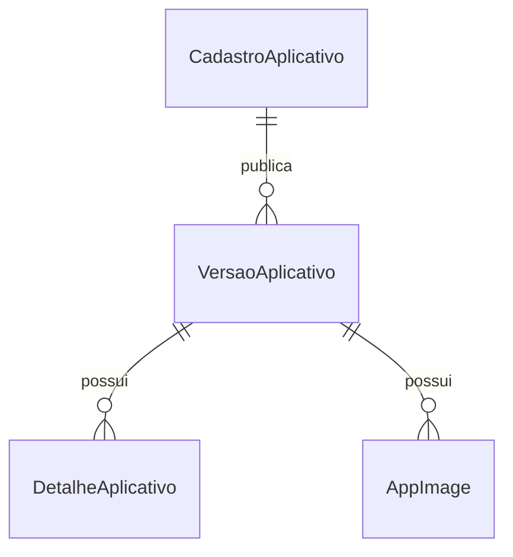

# Proposta de Modelagem para Publicação de Aplicativos

## Objetivo
Garantir histórico, rastreabilidade e integridade dos dados publicados no portal dev, evitando perda ou sobrescrita de conteúdo em versões anteriores.

## Fluxo sugerido
1. **CadastroAplicativo**: funciona como rascunho/edição do app. Aqui o app é preparado, editado e validado.
2. **Publicação**: ao publicar, cria-se uma nova **VersaoAplicativo** que herda (duplica) os dados do cadastro, incluindo descrição, imagens e detalhes.
3. **VersaoAplicativo**: representa uma entrega oficial, imutável, com snapshot dos dados. Alterações futuras no cadastro não afetam versões já publicadas.

## Pontos-chave
- **DetalheAplicativo** e **Imagens** devem ser duplicados para cada versão publicada, nunca referenciados globalmente.
- **VersaoAplicativo** deve ter relação direta com os detalhes e imagens publicados.
- **CadastroAplicativo** pode ser editado livremente, mas só afeta novas publicações.
- **Soft delete** e **auditoria** para garantir rastreabilidade e evitar perda de dados.
- **Relacionamentos**: cada versão publicada tem seu próprio conjunto de detalhes/imagens.

## Benefícios
- Histórico preservado: versões antigas nunca são alteradas ou perdidas.
- Segurança para o time de dados: entregas no ar são imutáveis.
- Facilidade de auditoria e rollback.
- Fluxo claro entre edição (rascunho) e publicação (snapshot).

## Exemplo de entidades
- **CadastroAplicativo**: rascunho/editável
- **VersaoAplicativo**: snapshot imutável
- **DetalheAplicativo**: duplicado por versão
- **AppImage**: duplicada por versão

## Diagrama simplificado

## Observações finais
- Nunca altere ou remova dados de versões publicadas.
- Sempre crie novos registros para cada publicação.
- Documente o fluxo para o time de dados e devs.

---
*Esta proposta visa garantir integridade e histórico no portal dev. Avalie com o time de dados e ajuste conforme necessidades específicas.*
