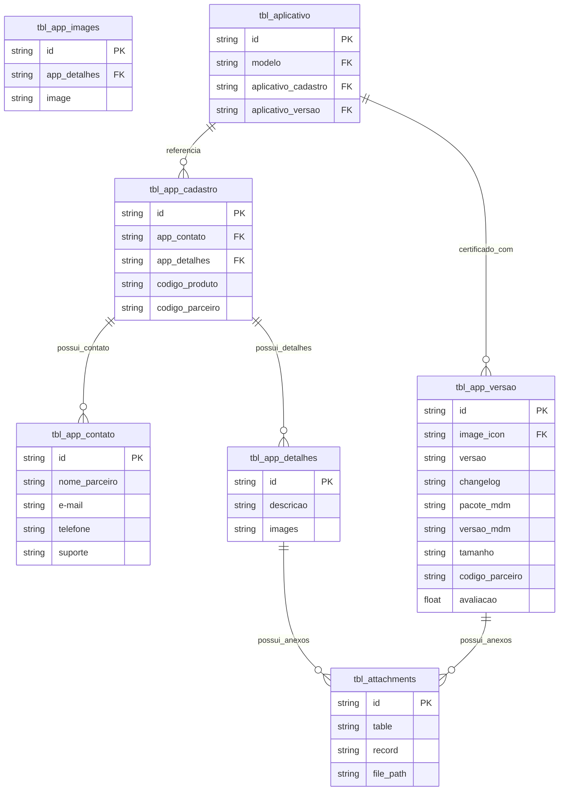

# Diagrama Entidade-Relacionamento (ER)

Este arquivo contém o diagrama ER do projeto original, útil para referência e reuso.

```mermaid
erDiagram
    tbl_app_cadastro {
        string id PK
        string app_contato FK
        string app_detalhes FK
        string codigo_produto
        string codigo_parceiro
    }

    tbl_app_contato {
        string id PK
        string nome_parceiro
        string e-mail
        string telefone
        string suporte
    }

    tbl_app_detalhes {
        string id PK
        string descricao
        string images
    }

    tbl_app_images {
        string id PK
        string app_detalhes FK
        string image
    }

    tbl_attachments {
        string id PK
        string table
        string record
        string file_path
    }

    tbl_app_versao {
        string id PK
        string image_icon FK
        string versao
        string changelog
        string pacote_mdm
        string versao_mdm
        string tamanho
        string codigo_parceiro
        float avaliacao
    }

    tbl_aplicativo {
        string id PK
        string modelo FK
        string aplicativo_cadastro FK
        string aplicativo_versao FK
    }

    %% Relacionamentos ajustados
    tbl_app_cadastro ||--o{ tbl_app_contato : possui_contato
    tbl_app_cadastro ||--o{ tbl_app_detalhes : possui_detalhes
    tbl_aplicativo ||--o{ tbl_app_cadastro : referencia
    tbl_aplicativo ||--o{ tbl_app_versao : certificado_com
    tbl_app_versao ||--o{ tbl_attachments : possui_anexos
    tbl_app_detalhes ||--o{ tbl_attachments : possui_anexos
```

<!-- Informações do app, parceiro, avaliação, imagens, etc. -->
